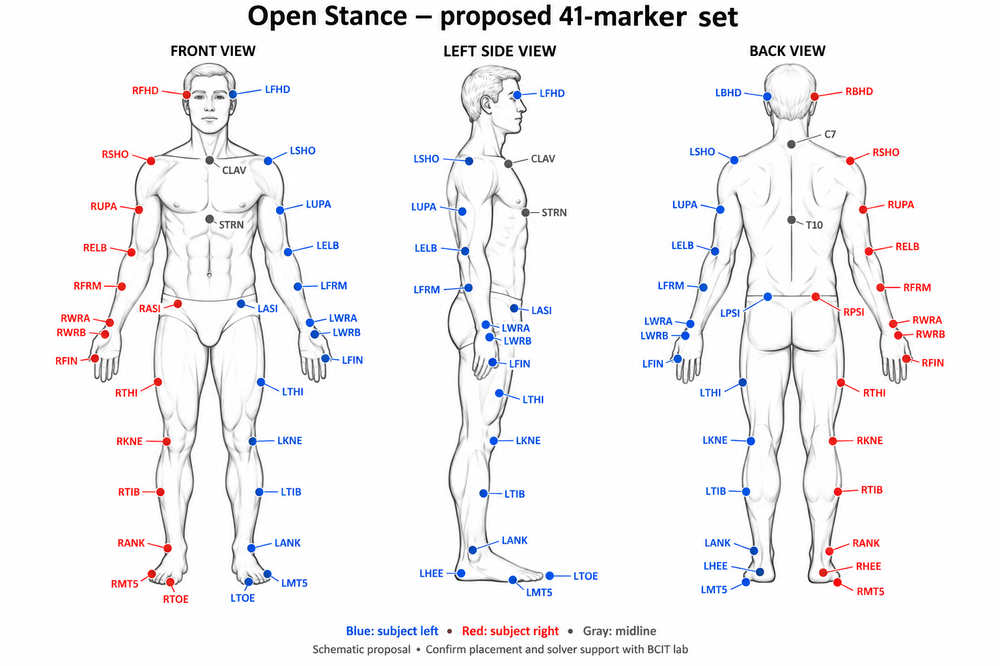

# Desired motion-capture marker set

Proposed **41-marker full-body set** for Open Stance, transcribed from [the project marker diagram](Mocap_Marker_Set.png). The diagram describes this as Plug-in Gait full body (39) plus left/right fifth-metatarsal markers (2) for kick foot orientation. Confirm the actual placement, labels and solver support with BCIT before capture; this is not a confirmed lab template.

L/R always mean the performer's left/right. Blue is left, red is right, gray is midline. The drawing is schematic; use the lab's anatomical placement protocol.

| Region | Labels | Placement | Count |
| --- | --- | --- | ---: |
| Head | LFHD, RFHD | Left/right front head (temples) | 2 |
| Head | LBHD, RBHD | Left/right back head | 2 |
| Torso | C7 | Seventh cervical vertebra | 1 |
| Torso | T10 | Tenth thoracic vertebra | 1 |
| Torso | CLAV | Jugular notch | 1 |
| Torso | STRN | Sternum, xiphoid process | 1 |
| Torso | RBAK | Right scapular area; asymmetric labeling marker | 1 |
| Arms | LSHO, RSHO | Left/right acromion (shoulder) | 2 |
| Arms | LUPA, RUPA | Left/right upper arm | 2 |
| Arms | LELB, RELB | Left/right lateral elbow epicondyle | 2 |
| Arms | LFRM, RFRM | Left/right forearm | 2 |
| Arms | LWRA, RWRA | Left/right wrist, thumb side | 2 |
| Arms | LWRB, RWRB | Left/right wrist, little-finger side | 2 |
| Hands | LFIN, RFIN | Left/right hand, second knuckle | 2 |
| Pelvis | LASI, RASI | Left/right anterior superior iliac spine (ASIS) | 2 |
| Pelvis | LPSI, RPSI | Left/right posterior superior iliac spine (PSIS) | 2 |
| Legs | LTHI, RTHI | Left/right thigh | 2 |
| Legs | LKNE, RKNE | Left/right lateral knee epicondyle | 2 |
| Legs | LTIB, RTIB | Left/right shank | 2 |
| Legs | LANK, RANK | Left/right lateral malleolus (outer ankle) | 2 |
| Feet | LHEE, RHEE | Left/right heel | 2 |
| Feet | LTOE, RTOE | Left/right second metatarsal head | 2 |
| Feet, additional | LMT5, RMT5 | Left/right fifth metatarsal head (outer forefoot) | 2 |
| **Total** | | | **41** |

## Lab handoff

- Confirm the lab's full-body template and actual limb-marker offsets; preserve the lab's labels in export and document any differences from this proposal.
- Confirm how the two additional foot markers will be used by the chosen solver. Adding them does not automatically change the solve.
- Capture a calibration pose and a short guard, step, chamber, kick and return test, including a turn.
- Take home labeled, processed C3D files for calibration and movement, the actual placement diagram, performer measurements, capture rate, units and axes. Collect a solved skeleton FBX if available.
- Fit the MotionBuilder Actor and map markers using the actual session placement, as described in [the Nexus test plan](Vicon_Nexus_Test.md).
